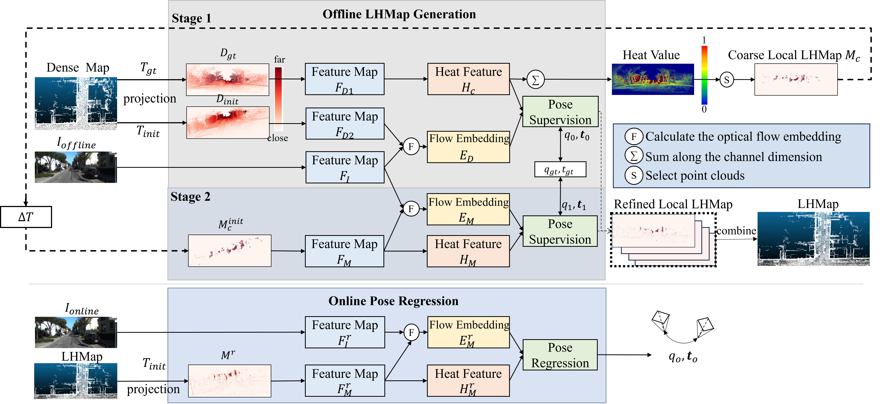

## LHMap-loc: Cross-Modal Monocular Localization Using LiDAR Point Cloud Heat Map (ICRA 2024) 
#### Xinrui Wu, Jianbo Xu, Puyuan Hu, Guangming Wang, Hesheng Wang

Our paper is available at:
* [Arxiv](https://arxiv.org/abs/2403.05002)
* [IEEE](https://ieeexplore.ieee.org/document/10610718)
### Requirements
The dependencies installation and data prepration please refer to [CMRNet](https://github.com/cattaneod/CMRNet).

### LHMap construction
  ```
python main_single_map.py with batch_size=8 data_folder=./KITTI_ODOMETRY/sequences/ epochs=120 max_r=10 max_t=2 BASE_LEARNING_RATE=0.0001 savemodel=./checkpoints/ test_sequence=00 
  ```

### LHMap saving
Change folder path to save LiDAR point cloud in "./models/CMRNet/CMRNet_single_save.py" 
  ```
python main_single_save.py with batch_size=1 data_folder=./KITTI_ODOMETRY/sequences/  weights='./checkpoints/xxx.tar' test_sequence=00
python main_single_save.py with batch_size=1 data_folder=./KITTI_ODOMETRY/sequences/  weights='./checkpoints/xxx.tar' test_sequence=03
python main_single_save.py with batch_size=1 data_folder=./KITTI_ODOMETRY/sequences/  weights='./checkpoints/xxx.tar' test_sequence=05
python main_single_save.py with batch_size=1 data_folder=./KITTI_ODOMETRY/sequences/  weights='./checkpoints/xxx.tar' test_sequence=06
python main_single_save.py with batch_size=1 data_folder=./KITTI_ODOMETRY/sequences/  weights='./checkpoints/xxx.tar' test_sequence=07
python main_single_save.py with batch_size=1 data_folder=./KITTI_ODOMETRY/sequences/  weights='./checkpoints/xxx.tar' test_sequence=08
python main_single_save.py with batch_size=1 data_folder=./KITTI_ODOMETRY/sequences/  weights='./checkpoints/xxx.tar' test_sequence=09
  ```


### LHMap localization
Change folder path of LiDAR point cloud in "Dataset_kitti_localization.py" 
  ```
python main_single_loc.py with batch_size=12 data_folder=./KITTI_ODOMETRY/sequences/ epochs=150 max_r=10 max_t=2 BASE_LEARNING_RATE=0.0001 savemodel=./checkpoints/ test_sequence=00 
  ```


### Evaluation
  ```
python evaluate.py with test_sequence=00 maps_folder=local_maps data_folder=./KITTI_ODOMETRY/sequences/  weight="['./checkpoints/iter1.tar','./checkpoints/iter2.tar','./checkpoints/iter3.tar']"
  ```

### Results
You can require the weights for map generation [here](https://pan.quark.cn/s/d9dae03cfef3), and the weights for localization [here1](https://pan.quark.cn/s/1f87b7e00fc3), [here2](https://pan.quark.cn/s/179e68c04420), and [here3](https://pan.quark.cn/s/521d2014b8d3).

The iteration results in KITTI:
|| <p>Median <br> Transl. error</p> | <p>Median <br> Rotation. error</p> |
|---|---|---|
| Iteration 1 | 0.21 m | 0.94° |
| Iteration 2 | 0.06 m | 0.35° |
| Iteration 3 | 0.03 m | 0.33° |


### Citation

If you use LHMap-loc, please cite:
```
@INPROCEEDINGS{10610718,
  author={Wu, Xinrui and Xu, Jianbo and Hu, Puyuan and Wang, Guangming and Wang, Hesheng},
  booktitle={2024 IEEE International Conference on Robotics and Automation (ICRA)}, 
  title={LHMap-loc: Cross-Modal Monocular Localization Using LiDAR Point Cloud Heat Map}, 
  year={2024},
  volume={},
  number={},
  pages={8500-8506},
  doi={10.1109/ICRA57147.2024.10610718}}
```